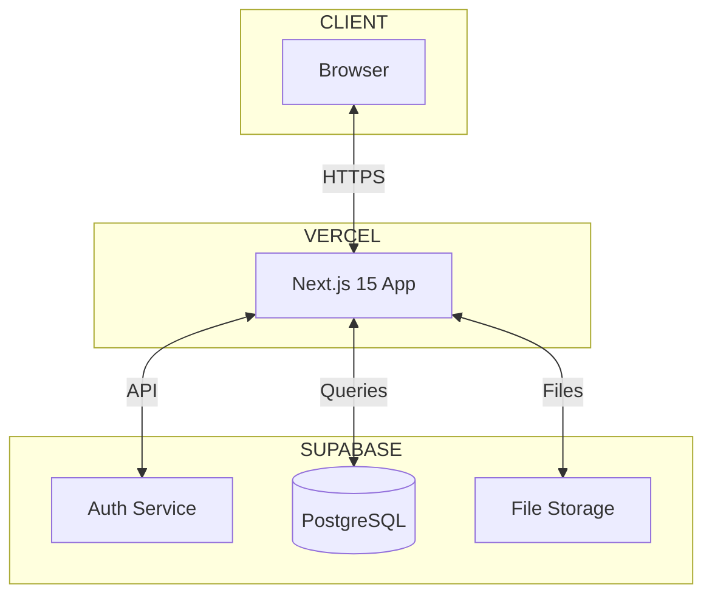
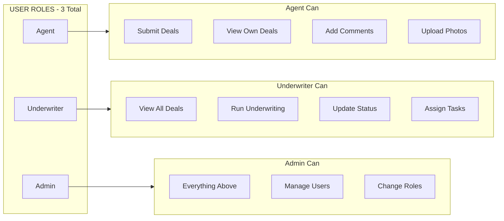
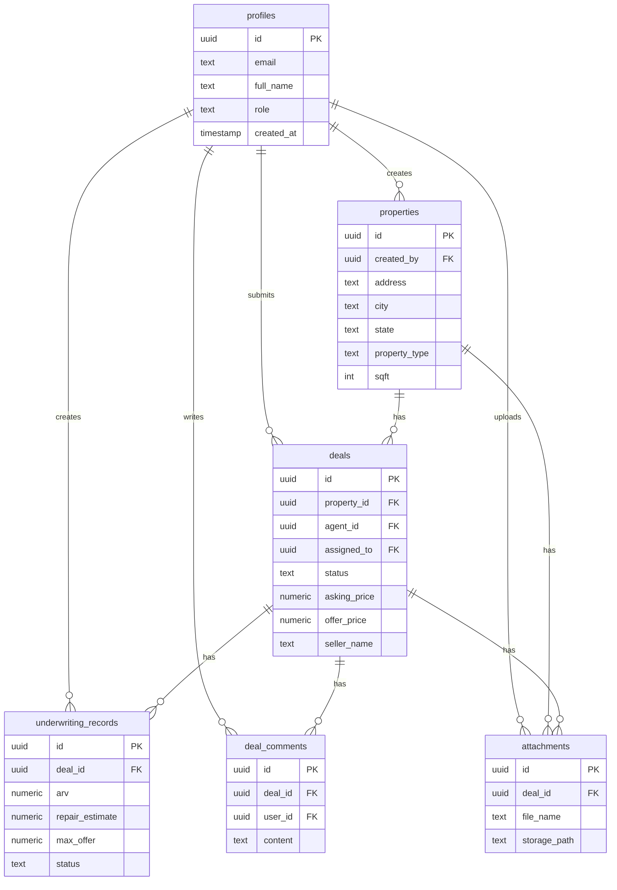
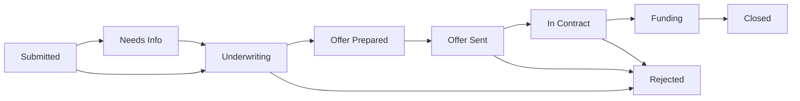
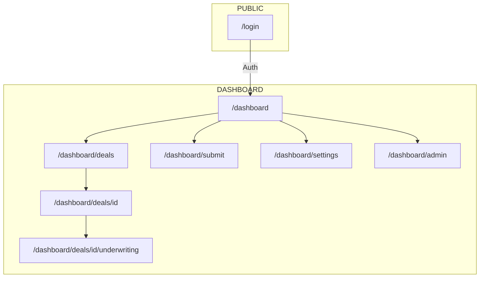
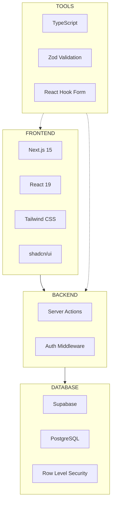
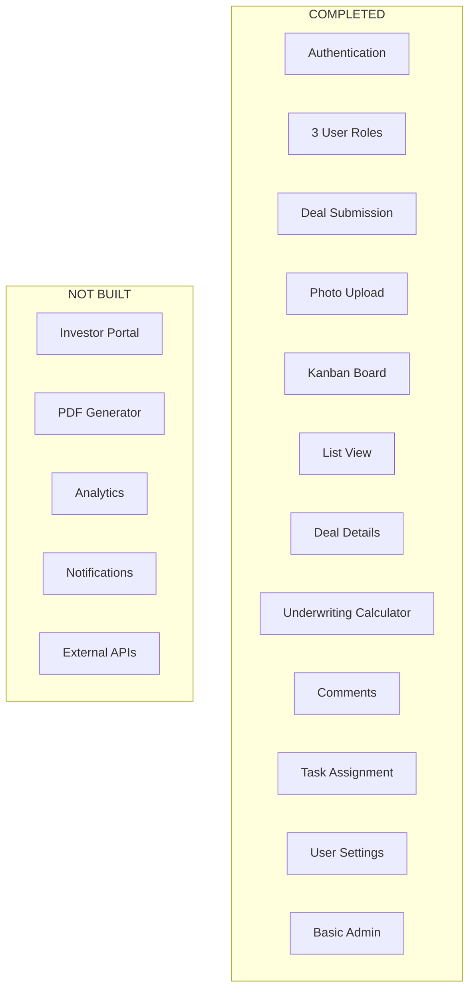

# Current Project Architecture (15% Complete)

## System Architecture

## User Roles

## Database Schema - 6 Tables

## Deal Pipeline - 9 Stages

## Page Structure

## Tech Stack

## Features Built

