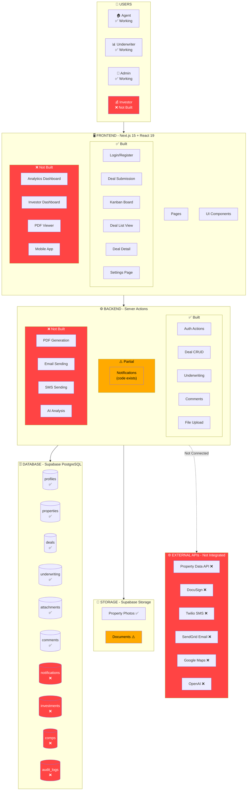

```mermaid
flowchart TB
    subgraph Users["👥 USERS"]
        direction LR
        Agent["🏠 Agent<br/>✅ Working"]
        UW["📊 Underwriter<br/>✅ Working"]
        Admin["👑 Admin<br/>✅ Working"]
        Investor["💰 Investor<br/>❌ Not Built"]
    end

    subgraph Frontend["🖥️ FRONTEND - Next.js 15 + React 19"]
        direction TB
        Pages["Pages"]
        Components["UI Components"]
        
        subgraph Built1["✅ Built"]
            Login["Login/Register"]
            DealForm["Deal Submission"]
            KanbanView["Kanban Board"]
            DealList["Deal List View"]
            DealDetail["Deal Detail"]
            Settings["Settings Page"]
        end
        
        subgraph NotBuilt1["❌ Not Built"]
            Analytics["Analytics Dashboard"]
            InvestorDash["Investor Dashboard"]
            PDFView["PDF Viewer"]
            MobileApp["Mobile App"]
        end
    end

    subgraph Backend["⚙️ BACKEND - Server Actions"]
        direction TB
        
        subgraph Built2["✅ Built"]
            AuthActions["Auth Actions"]
            DealActions["Deal CRUD"]
            UWActions["Underwriting"]
            CommentActions["Comments"]
            FileActions["File Upload"]
        end
        
        subgraph Partial["⚠️ Partial"]
            NotifyActions["Notifications<br/>(code exists)"]
        end
        
        subgraph NotBuilt2["❌ Not Built"]
            PDFGen["PDF Generation"]
            EmailSend["Email Sending"]
            SMSSend["SMS Sending"]
            AIAnalysis["AI Analysis"]
        end
    end

    subgraph Database["🗄️ DATABASE - Supabase PostgreSQL"]
        direction LR
        Profiles[("profiles<br/>✅")]
        Properties[("properties<br/>✅")]
        Deals[("deals<br/>✅")]
        UWRecords[("underwriting<br/>✅")]
        Attachments[("attachments<br/>✅")]
        Comments[("comments<br/>✅")]
        
        Notifications[("notifications<br/>❌")]
        Investments[("investments<br/>❌")]
        Comps[("comps<br/>❌")]
        AuditLogs[("audit_logs<br/>❌")]
    end

    subgraph Storage["📁 STORAGE - Supabase Storage"]
        Photos["Property Photos ✅"]
        Documents["Documents ⚠️"]
    end

    subgraph External["🌐 EXTERNAL APIs - Not Integrated"]
        PropAPI["Property Data API ❌"]
        DocuSign["DocuSign ❌"]
        Twilio["Twilio SMS ❌"]
        SendGrid["SendGrid Email ❌"]
        Maps["Google Maps ❌"]
        OpenAI["OpenAI ❌"]
    end

    Users --> Frontend
    Frontend --> Backend
    Backend --> Database
    Backend --> Storage
    Backend -.->|"Not Connected"| External

    style Investor fill:#ff4444,color:#fff
    style NotBuilt1 fill:#ff4444,color:#fff
    style NotBuilt2 fill:#ff4444,color:#fff
    style Notifications fill:#ff4444,color:#fff
    style Investments fill:#ff4444,color:#fff
    style Comps fill:#ff4444,color:#fff
    style AuditLogs fill:#ff4444,color:#fff
    style External fill:#ff4444,color:#fff
    style Partial fill:#ffaa00,color:#000
    style NotifyActions fill:#ffaa00,color:#000
    style Documents fill:#ffaa00,color:#000
```
