# Current Project Architecture (15% Complete)

## System Architecture

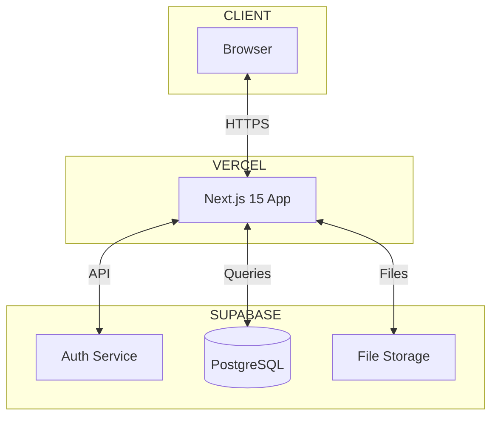

## User Roles

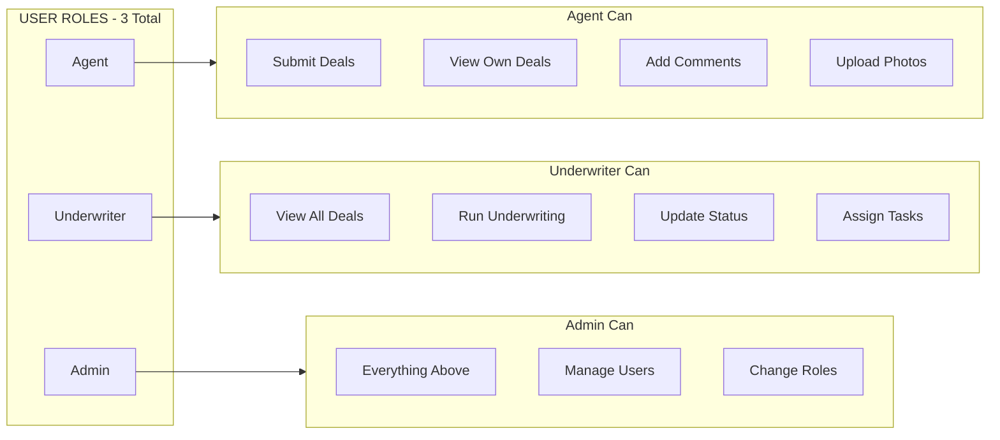

## Database Schema - 6 Tables

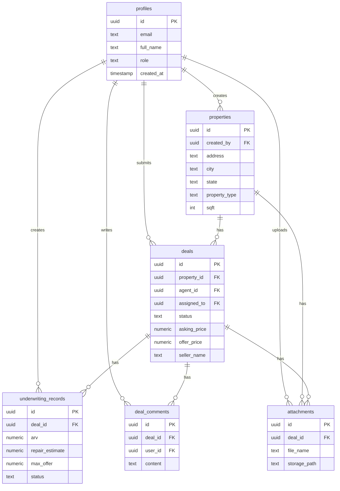

## Deal Pipeline - 9 Stages

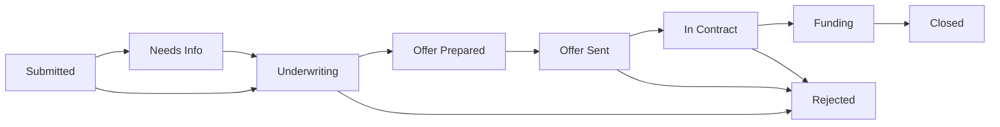

## Page Structure

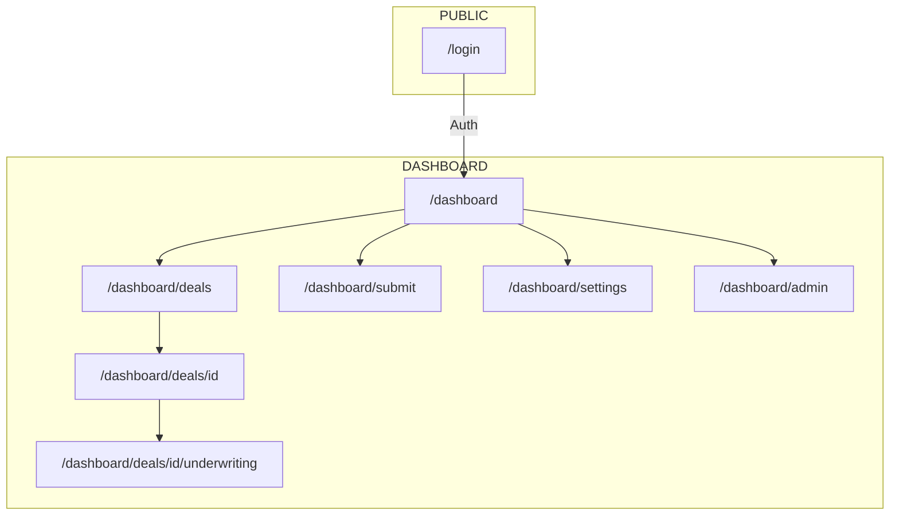

## Tech Stack

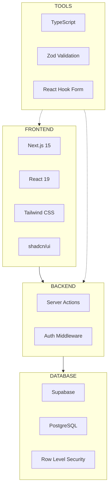

## Features Built

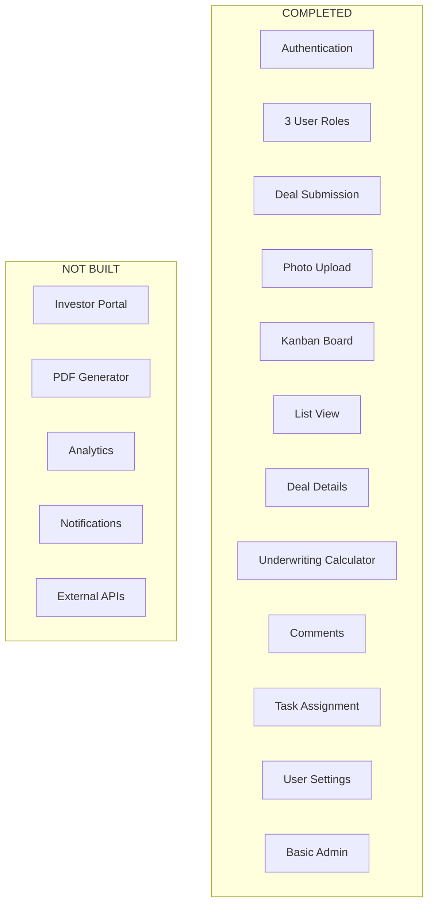

# Full Platform Architecture (100% Complete)

## System Architecture

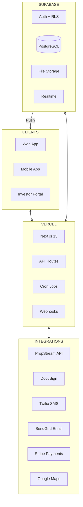

## User Roles - 4 Total

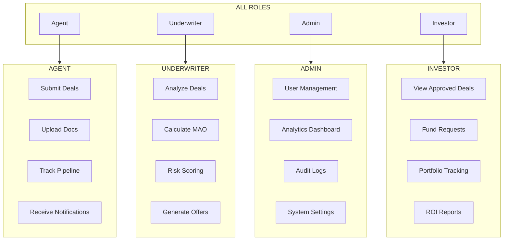

## Database Schema - 12+ Tables

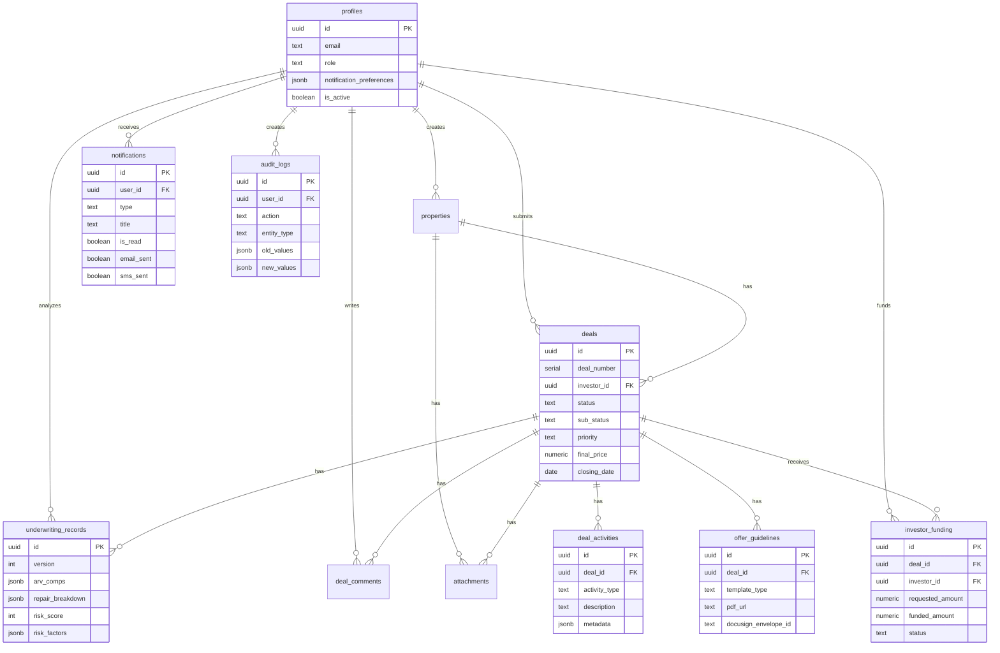

## Feature Map

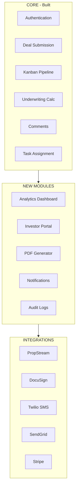

## Full Page Structure

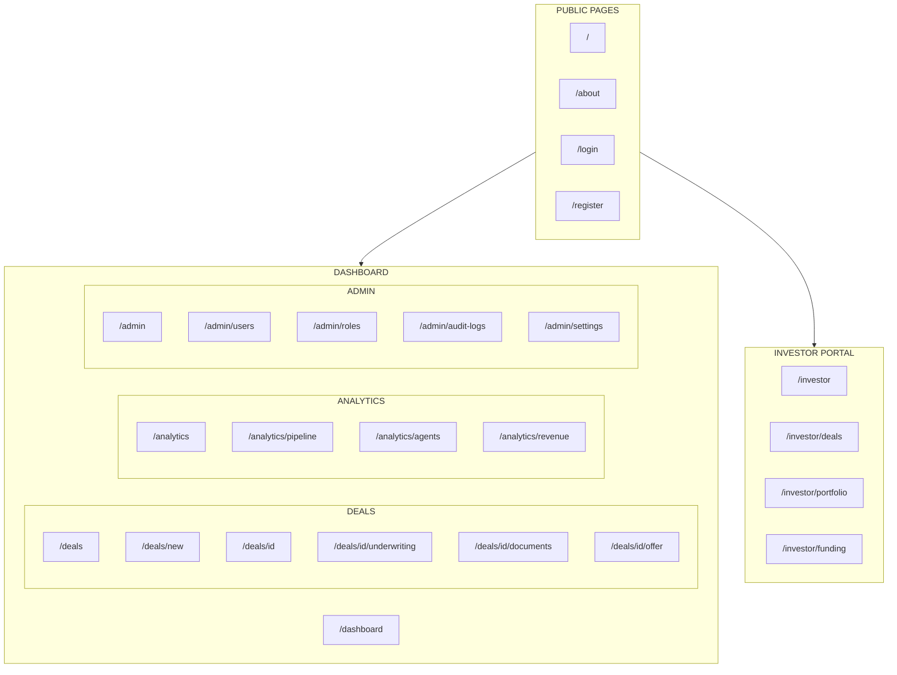

## Data Flow

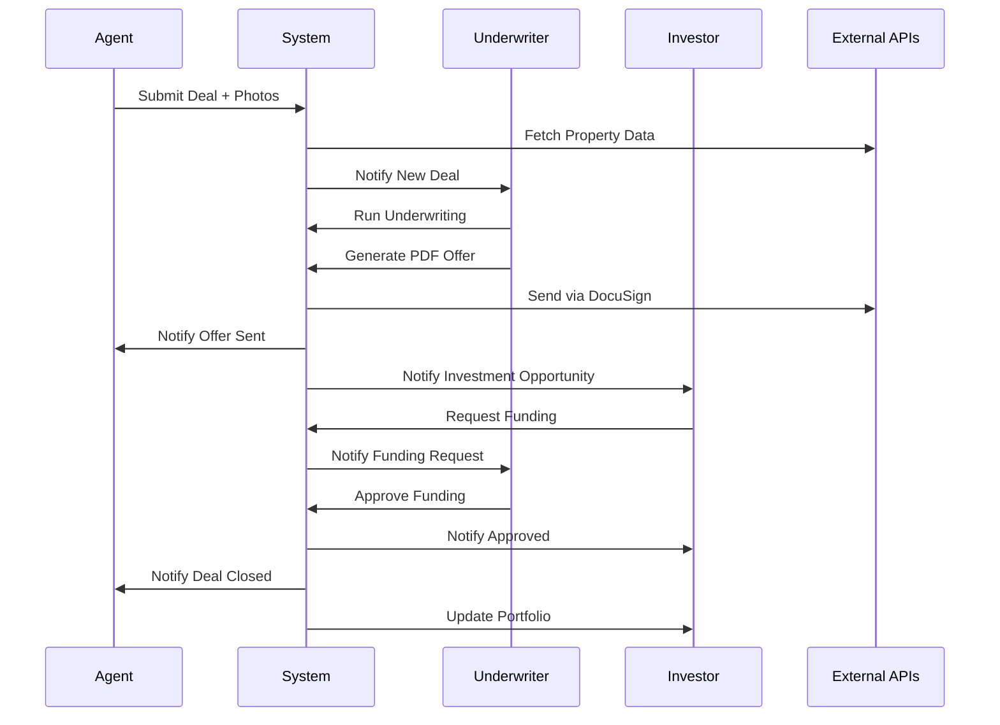

## Notification System

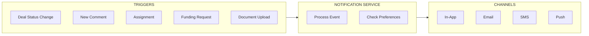

## Comparison: Current vs Full

```mermaid
flowchart LR
    subgraph Current["CURRENT 15%"]
        direction TB
        CC1["Auth 3 roles"]
        CC2["Deal CRUD"]
        CC3["Kanban"]
        CC4["Underwriting"]
        CC5["Comments"]
        CC6["Basic Admin"]
    end

    subgraph Full["FULL 100%"]
        direction TB
        FC1["Auth 4 roles"]
        FC2["Deal CRUD++"]
        FC3["Kanban++"]
        FC4["Underwriting++"]
        FC5["Comments++"]
        FC6["Full Admin"]
        FC7["Investor Portal"]
        FC8["Analytics"]
        FC9["PDF Generator"]
        FC10["Notifications"]
        FC11["Audit Logs"]
        FC12["6 Integrations"]
    end

    Current -->|Expand| Full
```

## Development Timeline

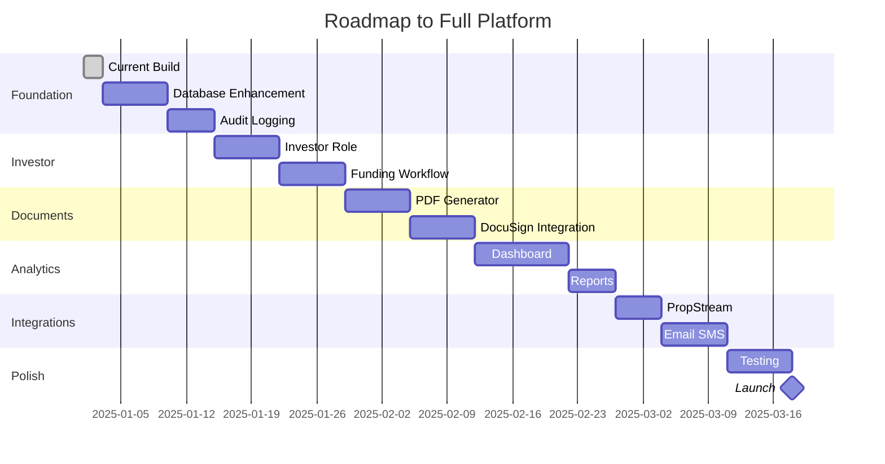

## Feature Completion

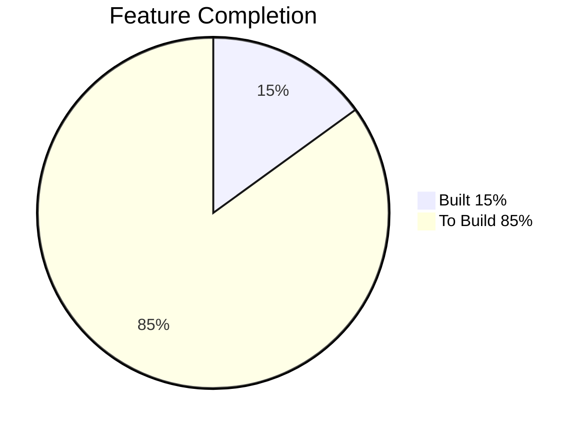
