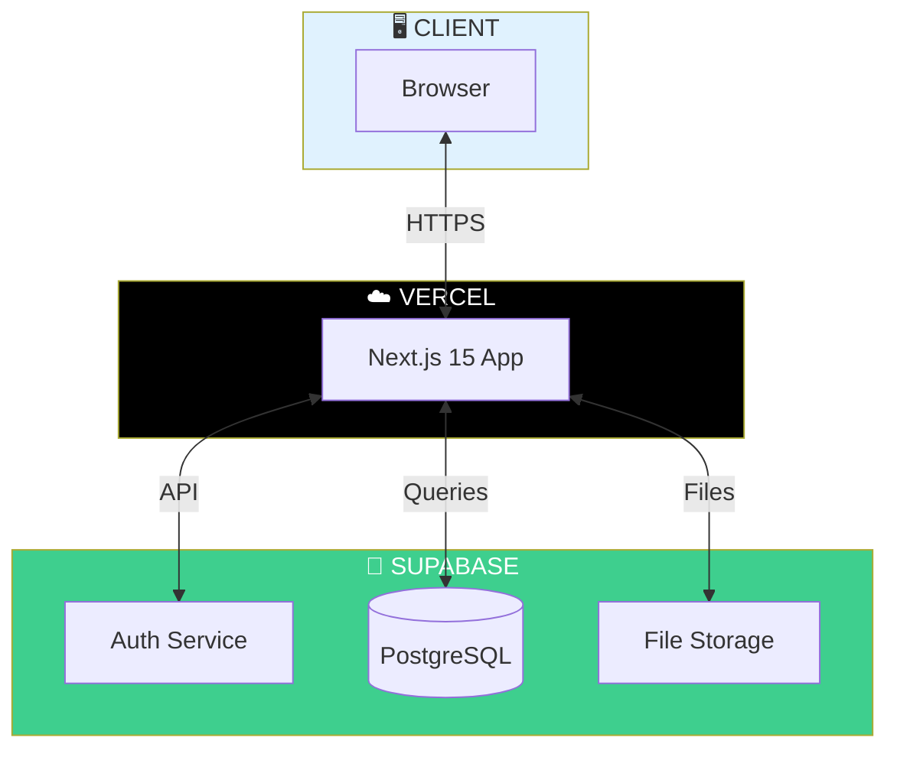
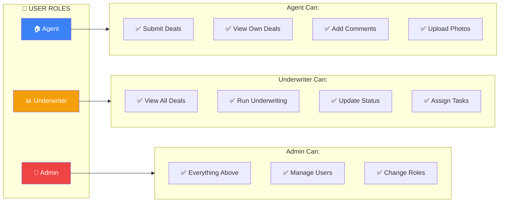
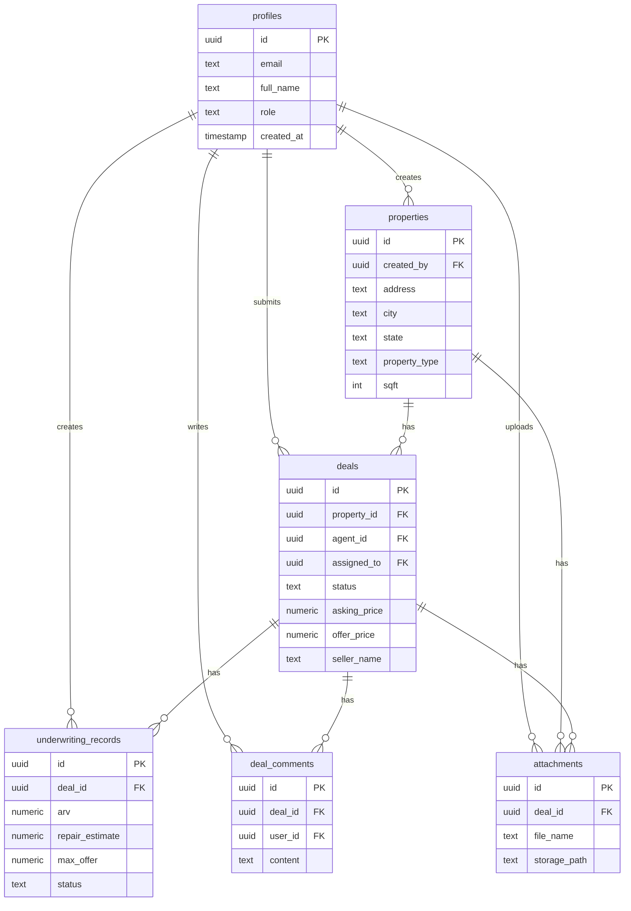
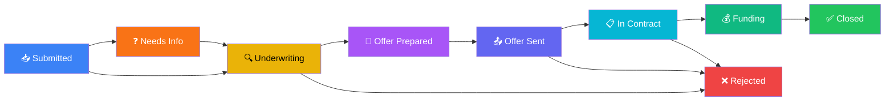
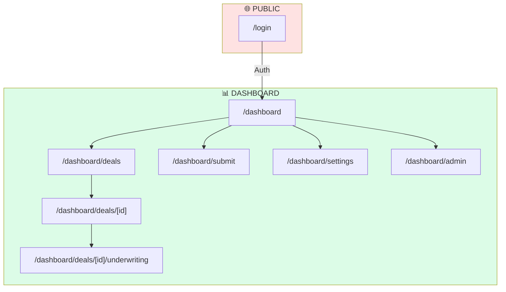
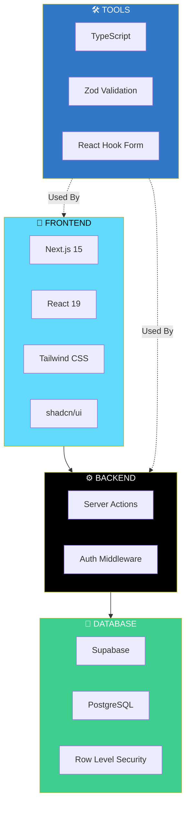

```mermaid
flowchart TB
    subgraph Client["🖥️ CLIENT"]
        Browser["Browser"]
    end

    subgraph Vercel["☁️ VERCEL"]
        Next["Next.js 15 App"]
    end

    subgraph Supabase["🔐 SUPABASE"]
        Auth["Auth Service"]
        DB[(PostgreSQL)]
        Storage["File Storage"]
    end

    Browser <-->|"HTTPS"| Next
    Next <-->|"API"| Auth
    Next <-->|"Queries"| DB
    Next <-->|"Files"| Storage

    style Client fill:#e0f2fe
    style Vercel fill:#000,color:#fff
    style Supabase fill:#3ecf8e,color:#fff
```

```mermaid
flowchart LR
    subgraph Roles["👥 USER ROLES"]
        Agent["🏠 Agent"]
        UW["📊 Underwriter"]
        Admin["👑 Admin"]
    end

    subgraph AgentPerms["Agent Can:"]
        A1["✅ Submit Deals"]
        A2["✅ View Own Deals"]
        A3["✅ Add Comments"]
        A4["✅ Upload Photos"]
    end

    subgraph UWPerms["Underwriter Can:"]
        U1["✅ View All Deals"]
        U2["✅ Run Underwriting"]
        U3["✅ Update Status"]
        U4["✅ Assign Tasks"]
    end

    subgraph AdminPerms["Admin Can:"]
        AD1["✅ Everything Above"]
        AD2["✅ Manage Users"]
        AD3["✅ Change Roles"]
    end

    Agent --> AgentPerms
    UW --> UWPerms
    Admin --> AdminPerms

    style Agent fill:#3b82f6,color:#fff
    style UW fill:#f59e0b,color:#fff
    style Admin fill:#ef4444,color:#fff
```

```mermaid
erDiagram
    profiles ||--o{ deals : "submits"
    profiles ||--o{ properties : "creates"
    profiles ||--o{ underwriting_records : "creates"
    profiles ||--o{ deal_comments : "writes"
    profiles ||--o{ attachments : "uploads"
    
    properties ||--o{ deals : "has"
    properties ||--o{ attachments : "has"
    
    deals ||--o{ underwriting_records : "has"
    deals ||--o{ deal_comments : "has"
    deals ||--o{ attachments : "has"

    profiles {
        uuid id PK
        text email
        text full_name
        text role
        timestamp created_at
    }

    properties {
        uuid id PK
        uuid created_by FK
        text address
        text city
        text state
        text property_type
        int sqft
    }

    deals {
        uuid id PK
        uuid property_id FK
        uuid agent_id FK
        uuid assigned_to FK
        text status
        numeric asking_price
        numeric offer_price
        text seller_name
    }

    underwriting_records {
        uuid id PK
        uuid deal_id FK
        numeric arv
        numeric repair_estimate
        numeric max_offer
        text status
    }

    deal_comments {
        uuid id PK
        uuid deal_id FK
        uuid user_id FK
        text content
    }

    attachments {
        uuid id PK
        uuid deal_id FK
        text file_name
        text storage_path
    }
```

```mermaid
flowchart LR
    S1["📥 Submitted"]
    S2["❓ Needs Info"]
    S3["🔍 Underwriting"]
    S4["📝 Offer Prepared"]
    S5["📤 Offer Sent"]
    S6["📋 In Contract"]
    S7["💰 Funding"]
    S8["✅ Closed"]
    S9["❌ Rejected"]

    S1 --> S2
    S1 --> S3
    S2 --> S3
    S3 --> S4
    S3 --> S9
    S4 --> S5
    S5 --> S6
    S5 --> S9
    S6 --> S7
    S6 --> S9
    S7 --> S8

    style S1 fill:#3b82f6,color:#fff
    style S2 fill:#f97316,color:#fff
    style S3 fill:#eab308,color:#000
    style S4 fill:#a855f7,color:#fff
    style S5 fill:#6366f1,color:#fff
    style S6 fill:#06b6d4,color:#fff
    style S7 fill:#10b981,color:#fff
    style S8 fill:#22c55e,color:#fff
    style S9 fill:#ef4444,color:#fff
```

```mermaid
flowchart TD
    subgraph Public["🌐 PUBLIC"]
        Login["/login"]
    end

    subgraph Dashboard["📊 DASHBOARD"]
        Home["/dashboard"]
        Deals["/dashboard/deals"]
        DealDetail["/dashboard/deals/[id]"]
        Underwriting["/dashboard/deals/[id]/underwriting"]
        Submit["/dashboard/submit"]
        Settings["/dashboard/settings"]
        Admin["/dashboard/admin"]
    end

    Login -->|"Auth"| Home
    Home --> Deals
    Home --> Submit
    Home --> Settings
    Home --> Admin
    Deals --> DealDetail
    DealDetail --> Underwriting

    style Public fill:#fee2e2
    style Dashboard fill:#dcfce7
```

```mermaid
flowchart TB
    subgraph Frontend["🎨 FRONTEND"]
        Next["Next.js 15"]
        React["React 19"]
        TW["Tailwind CSS"]
        Shadcn["shadcn/ui"]
    end

    subgraph Backend["⚙️ BACKEND"]
        ServerActions["Server Actions"]
        Middleware["Auth Middleware"]
    end

    subgraph Database["💾 DATABASE"]
        Supa["Supabase"]
        PG["PostgreSQL"]
        RLS["Row Level Security"]
    end

    subgraph Tools["🛠️ TOOLS"]
        TS["TypeScript"]
        Zod["Zod Validation"]
        RHF["React Hook Form"]
    end

    Frontend --> Backend
    Backend --> Database
    Tools -.->|"Used By"| Frontend
    Tools -.->|"Used By"| Backend

    style Frontend fill:#61dafb,color:#000
    style Backend fill:#000,color:#fff
    style Database fill:#3ecf8e,color:#fff
    style Tools fill:#3178c6,color:#fff
```
